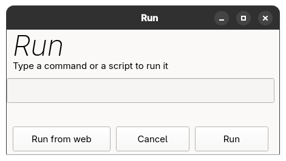

# MintRun
A quite simple recreation on the Windows run command in python and qt. Also allowing you to run scripts from the internet.




## 🛜 Installation
You can either get it from the releases or run this command

```curl [link to install.sh] | bash```

Or just download the ``install.sh`` script and run it
If you want, just do it all your self

## 💻 Usage
Type the command run in the terminal and enjoy, or launch the desktop link

Confused on how to use it? You'll figure it out.

## 🤔 Build
Run the ``build.sh`` script or use makepkg -s
Or build directly from the web using the command ``curl [buildsh] | bash`` or using ``[buildsh]`` and selecting ``Run From Web`` in MintRun
Or using ``mintybuild build mintrun`` ___(MintyBuild does not exist yet lmao, I might make it soon)___


## ❔Why would I want this
You know when you want to run an app but you have to open the terminal to run the it and then you can't close terminal or the app will also close? This is lets you run things the you'd otherwise need the terminal for without having tstrong texto keep the terminal open for them. First examples that comes to my mind is ``box64 steam``  or ``waydroid show-full-ui`` (unless you are debugging them)

_//totally not only since I wanted to learn how to make something basic using python qt, I'm quite new to programming btw_
